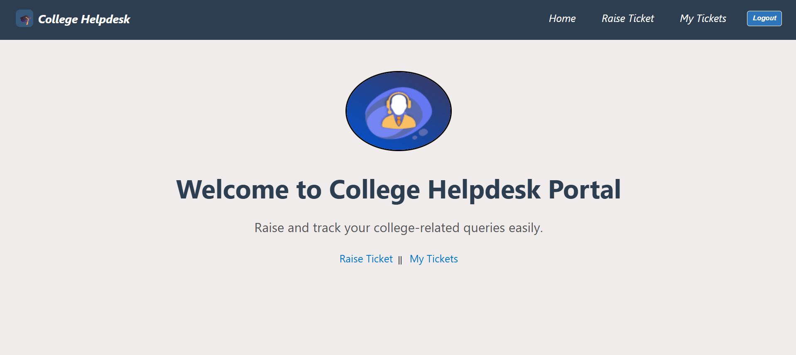
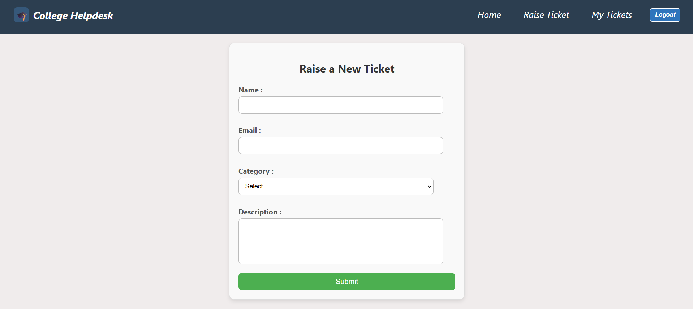
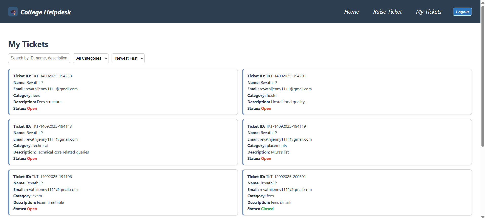
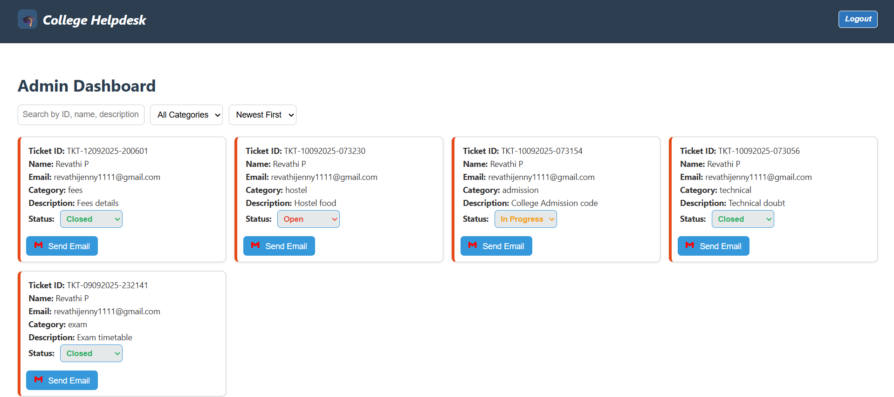

# 🎓 College Helpdesk Portal

A web-based helpdesk portal built with **React.js**, HTML, and CSS.  
This project provides role-based access for **students** and **admins** with separate dashboards.  
(Currently using a **dummy login system**, backend authentication will be added later.)

---

## ✨ Features

- 🔑 **Login System** (student & admin with hardcoded credentials for now)  
- 🎯 **Student Dashboard** – access to queries, course info, events, etc.  
- 🛠 **Admin Dashboard** – manage student queries and oversee helpdesk activities.  
- 📱 **Responsive UI** – works on desktop and mobile.  

---

## 🚀 Getting Started

### Clone the repository
```bash
git clone https://github.com/RevathiSavithiri/college-helpdesk.git
cd college-helpdesk
```
##  Install dependencies
```bash
npm install
```

##  Run the app
```bash
npm start
```
Open http://localhost:3000 to view it in your browser.

---

🛠 Tech Stack
- ⚛️ React.js – frontend framework
- 🖼 HTML5, CSS3 – styling and structure
- ✨ JavaScript (ES6+) – functionality

---

📌 Future Improvements
- ✅ Add backend authentication (Node.js + MySQL)
- ✅ Role-based access control
- ✅ Deploy to Netlify/Heroku for public access
- ✅ Enhanced dashboards with analytics

---

## 👩‍💻 Author
**Revathi Savithiri**  
🌐 GitHub: [RevathiSavithiri](https://github.com/RevathiSavithiri)

## 📷 Screenshots

### Login


### Student Dashboard


### Raise Ticket


### My Tickets


### Admin Dashboard

